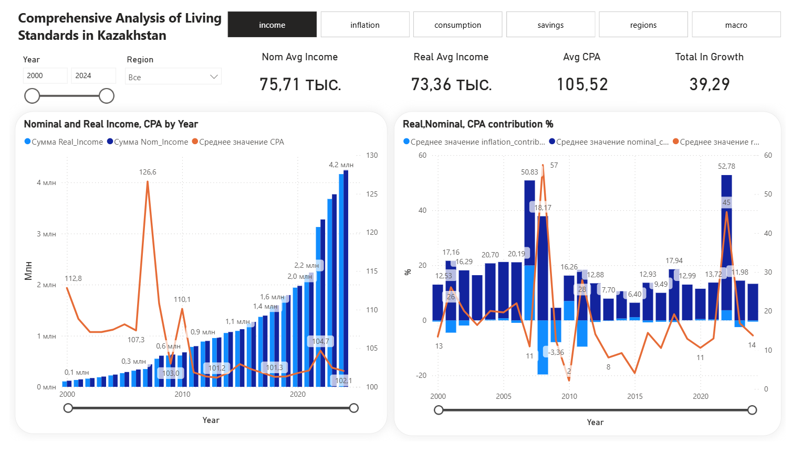
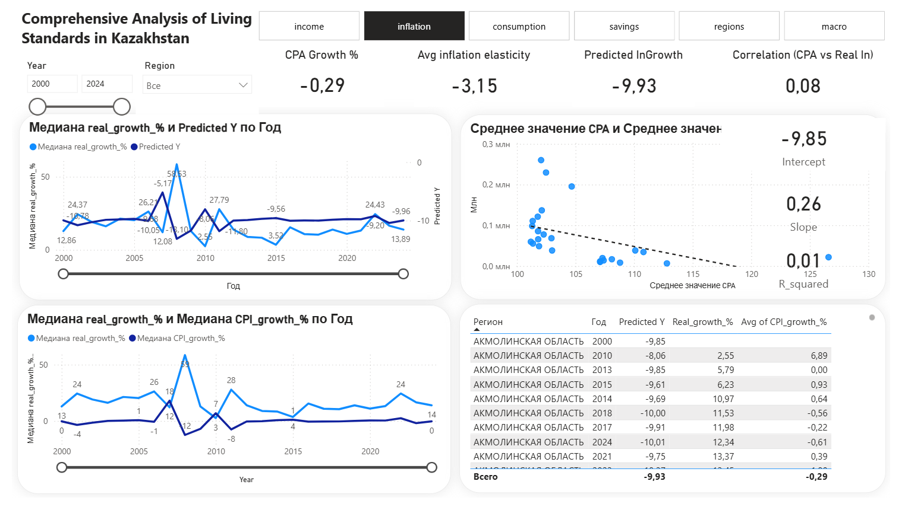
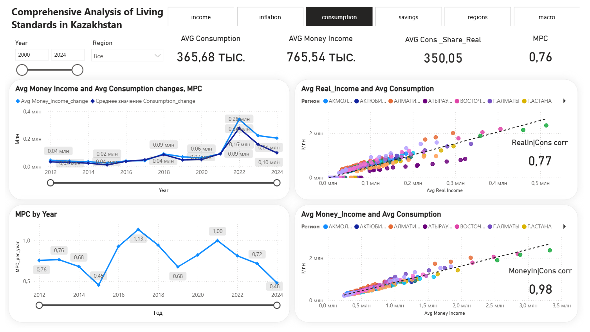
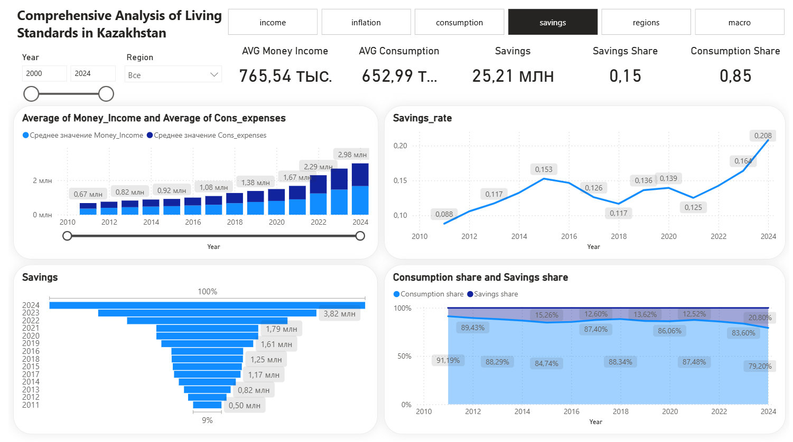
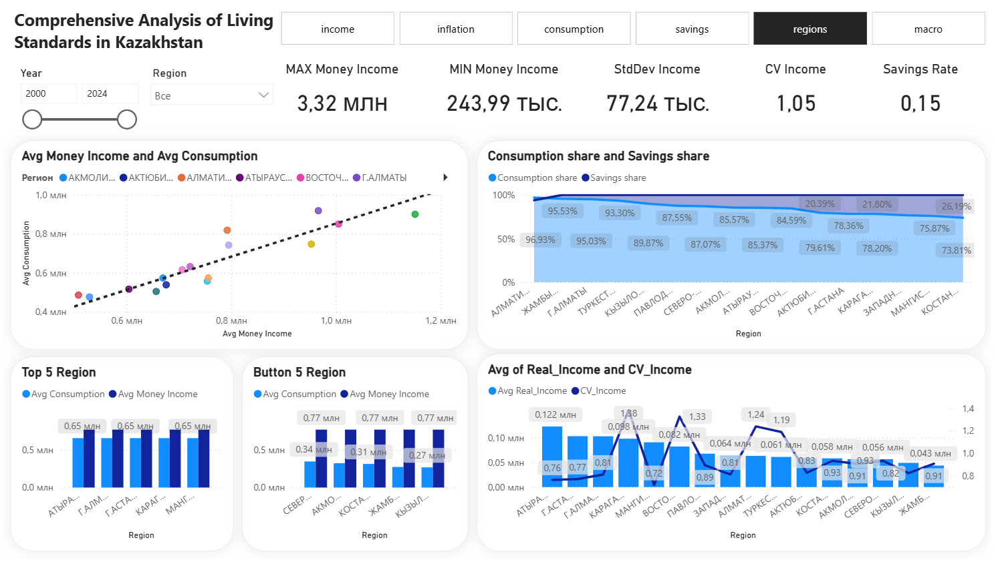
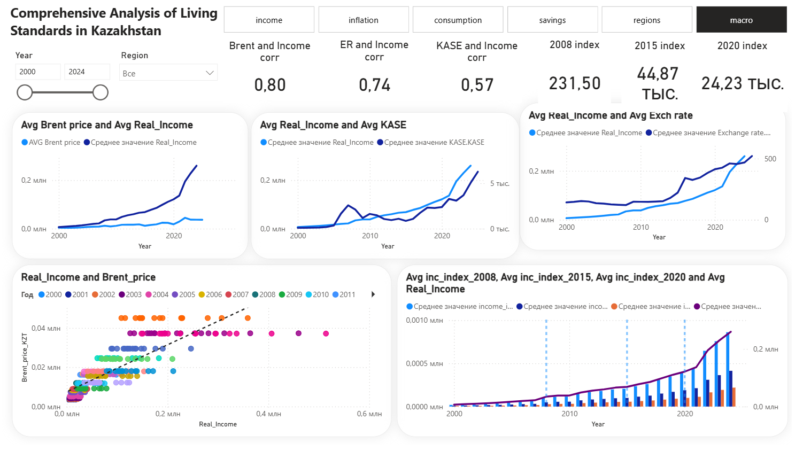

# Analysis-of-Living-Standards-in-Kazakhstan

## Project Objective
Analysis of income, inflation, consumption, savings, macro trends and regional differences in Kazakhstan using Python, SQL and Power BI.

## Tools Used
- Python (Data Cleaning, EDA)
- SQL (Database Storage & Querying)
- Power BI (Dashboard Development)
- Excel / CSV (Raw Data Sources)

## Project Workflow
Raw Data Sources  
↓  
Python (Cleaning & Feature Engineering)  
↓  
SQL Database Storage  
↓  
Power BI Data Connection  
↓  
Dashboard & Insights

## Key Insights
- Strong positive correlation between income and consumption.
- Inflation negatively impacts purchasing power.
- Regional inequality remains significant.
  
## Live Dashboard
[Open Interactive Dashboard]([https://app.powerbi.com/view?r=твоя_ссылка](https://app.powerbi.com/view?r=eyJrIjoiZWVkNmUxZWEtODcxZi00ODM3LThkNmYtY2Y4YzU1NWU4ZjMyIiwidCI6ImM4NDJjMmQ4LTUxY2UtNGJiNy1hZmUzLTE4OTRiNjk5MzY5MCIsImMiOjl9)

## Dashboard Preview

### Income Analysis

### Inflation Analysis

### Consumption Analysis

### Savings Analysis

### Regional Comparison

### Macro Analysis

## Full Report
See detailed analysis in:
[Project Report PDF](kazakhstan-income-analysis/insights
/Analysis-of-Living-Standards-in-Kazakhstan_insights.pdf)
